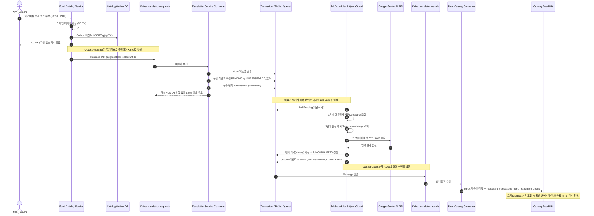

# 🛵 RTC Delivery (Real-Time Commerce Delivery)
> **MSA 환경에서 Apache Kafka와 LLM(Gemini)을 결합한 이벤트 기반 AI 자동 번역 파이프라인 및 고가용성 글로벌 푸드 딜리버리 플랫폼**

[](https://spring.io/projects/spring-boot)
[](https://openjdk.org/)
[](https://kafka.apache.org/)
[](https://nuxt.com/)
[](https://vuejs.org/)
[](https://www.mysql.com/)
[](https://redis.io/)
[](https://ai.google.dev/)

---

## 🎬 서비스 시연 미리보기 (Demo Preview)

> 💡 *Cloudflare R2에 업로드된 GIF 이미지 링크를 아래 URL 위치에 붙여넣어 주세요.*

### 1️⃣ 전체적인 홈페이지의 구조
<!-- Cloudflare R2 GIF URL 1: 전체적인 홈페이지 구조 -->


---

### 2️⃣ Kafka 비동기를 활용한 AI 번역
<!-- Cloudflare R2 GIF URL 2: Kafka 비동기 AI 번역 과정 -->


---

### 3️⃣ 비동기 번역 완료 및 결과 확인
<!-- Cloudflare R2 GIF URL 3: 비동기 번역 완료 및 다국어 메뉴/데이터 반영 확인 -->


---

## 📌 목차
- [🎬 서비스 시연 미리보기](#-서비스-시연-미리보기-demo-preview)
1. [프로젝트 개요](#1-프로젝트-개요)
2. [핵심 기술 아키텍처](#2-핵심-기술-아키텍처)
3. [🔥 심층 분석: Kafka 기반 AI 비동기 번역 파이프라인](#3--심층-분석-kafka-기반-ai-비동기-번역-파이프라인)
   - [3.1 파이프라인 전체 흐름 및 시퀀스](#31-파이프라인-전체-흐름-및-시퀀스)
   - [3.2 2PC 없는 분산 데이터 정합성: Transactional Outbox & Inbox](#32-2pc-없는-분산-데이터-정합성-transactional-outbox--inbox)
   - [3.3 Kafka 컨슈머 블로킹 방지 및 비동기 워커 큐 분리](#33-kafka-컨슈머-블로킹-방지-및-비동기-워커-큐-분리)
   - [3.4 LLM 토큰 낭비 및 레이스 컨디션 방지: 잡 무효화 (Job Superseding)](#34-llm-토큰-낭비-및-레이스-컨디션-방지-잡-무효화-job-superseding)
   - [3.5 비용 및 쿼터 극대화 최적화: 3단계 번역 게이트 (3-Stage Gate)](#35-비용-및-쿼터-극대화-최적화-3단계-번역-게이트-3-stage-gate)
   - [3.6 장애 복구 및 쿼터 가드: 지수 백오프, 쿼터 보존 연기, DLT 격리](#36-장애-복구-및-쿼터-가드-지수-백오프-쿼터-보존-연기-dlt-격리)
   - [3.7 Database-per-Service 데이터 소유권 분리 & CQRS 조회 최적화](#37-database-per-service-데이터-소유권-분리--cqrs-조회-최적화)
4. [💡 추가 주요 기능 및 기술적 도전](#4-추가-주요-기능-및-기술적-도전)
   - [4.1 온디맨드 UGC(리뷰) 번역 & 어뷰징 방어](#41-온디맨드-ugc리뷰-번역--어뷰징-방어)
   - [4.2 관리자 관제 콘솔: 실시간 잡 모니터링 & 수동/일괄 재시도 파이프라인](#42-관리자-관제-콘솔-실시간-잡-모니터링--수동일괄-재시도-파이프라인)
   - [4.3 엔터프라이즈 보안: RSA 비대칭키 JWT & Gateway 헤더 스푸핑 방어](#43-엔터프라이즈-보안-rsa-비대칭키-jwt--gateway-헤더-스푸핑-방어)
   - [4.4 모던 프론트엔드: Nuxt 4 SSR, i18n 동적 전환, 동시성 토큰 갱신 큐](#44-모던-프론트엔드-nuxt-4-ssr-i18n-동적-전환-동시성-토큰-갱신-큐)
   - [4.5 주문·결제 수명주기: 멱등성 키, 카탈로그 스냅샷 & 비동기 사가(Choreography Saga)](#45-주문결제-수명주기-멱등성-키-카탈로그-스냅샷--비동기-사가choreography-saga)
5. [기술 스택](#5-기술-스택)
6. [프로젝트 구조](#6-프로젝트-구조)
7. [로컬 실행 방법](#7-로컬-실행-방법)
8. [환경 설정 가이드 (application-dev.properties Example)](#8-환경-설정-가이드-application-devproperties-example)

---

## 1. 프로젝트 개요

**RTC Delivery**는 한국과 일본 등 다국적 고객과 점주를 연결하는 **Real-Time Commerce 다국어 음식 주문/배달 플랫폼**입니다.

### 🎯 배경 및 핵심 문제 의식
1. **글로벌 커머스의 동적 콘텐츠 번역 한계**: 
   - 정적 UI 레이블(버튼, 메뉴 탭 등)은 클라이언트 i18n 파일로 해결할 수 있으나, **점주가 실시간으로 등록/수정하는 음식점명, 메뉴명, 상세 설명** 등 동적 데이터는 자동 번역 체계 없이는 다국어 서비스가 불가능합니다.
2. **동기식 외부 LLM 호출의 위험성**:
   - 메뉴 CRUD API에서 AI 번역을 동기식으로 호출할 경우, AI API의 높은 응답 지연(수 초)과 잦은 Rate Limit(429)으로 인해 **점주의 상품 등록 트랜잭션이 타임아웃되거나 롤백**되는 치명적인 문제가 발생합니다.
3. **분산 환경의 데이터 일관성 및 장애 전파**:
   - 마이크로서비스 간 DB가 분리된 환경(Database-per-Service)에서 외부 AI 서비스 장애가 카탈로그 서비스 장애로 번지는 것을 막아야 합니다.

### 💡 해결책
- **이벤트 주도 아키텍처(EDA)**와 **Transactional Outbox/Inbox 패턴**을 통해 점주의 CRUD 트랜잭션과 AI 번역 파이프라인을 완전 비동기로 분리.
- 번역 서비스 장애나 외부 AI API 쿼터 고갈 상황에서도 점주의 등록/수정과 고객의 카탈로그 조회가 100% 무중단 유지되는 **고가용성 분산 아키텍처**를 구축했습니다.

---

## 2. 핵심 기술 아키텍처

```
                                  ┌────────────────────────┐
                                  │   Nuxt 4 Frontend      │
                                  │   (SSR / Vue 3 / i18n) │
                                  └───────────┬────────────┘
                                              │ HTTP / REST
                                  ┌───────────▼────────────┐
                                  │   Spring Cloud Gateway │  ◄── RSA-256 JWT 비대칭키 검증
                                  │   (Port 8080)          │  ◄── Header Spoofing 방어
                                  └───────────┬────────────┘
                                              │
                    ┌─────────────────────────┼─────────────────────────┐
                    │                         │                         │
         ┌──────────▼──────────┐   ┌──────────▼──────────┐   ┌──────────▼──────────┐
         │ Food Catalog Service│   │ Member Auth Service │   │ Order/Payment Svc   │
         │ (Port 8081)         │   │ (Port 8082)         │   │ (Port 8083 / 8084)  │
         │ DB: rtc_food_catalog│   │ DB: rtc_member_auth │   │ DB: order / payment │
         └──────────┬──────────┘   └─────────────────────┘   └─────────────────────┘
                    │
                    │ 1. Transactional Outbox (translation-requests)
                    ▼
          ═══════════════════════════════════════════════════════════
                           Apache Kafka Cluster
          ═══════════════════════════════════════════════════════════
                    │                               ▲
                    │ 2. Job Enqueue (즉시 ACK)     │ 4. Transactional Outbox
                    ▼                               │    (translation-results)
         ┌──────────────────────────────────────────┴──────────┐
         │ Translation Service (Port 8085)                     │
         │ ├─ Consumer: DB 적재 후 即 ACK (Lag 방지)           │
         │ ├─ JobScheduler: 배치 스케줄러 & 락 제어            │
         │ ├─ 3-Stage Gate: 사전 ➔ 히스토리 캐시 ➔ Gemini 호출 │
         │ └─ DB: rtc_translation (Job, History, Glossary, UGC)│
         └──────────────────────────┬──────────────────────────┘
                                    │ 3. Batch API 호출 (남은 항목만)
                                    ▼
                         ┌─────────────────────┐
                         │ Gemini Developer API│
                         │ (Google AI Studio)  │
                         └─────────────────────┘
```

---

## 3. 🔥 심층 분석: Kafka 기반 AI 비동기 번역 파이프라인

본 프로젝트의 핵심 엔지니어링 결과물은 **점주가 메뉴를 등록/수정한 시점부터 고객이 번역된 메뉴를 조회하기까지의 전 과정을 무중단·무손실로 처리하는 비동기 AI 파이프라인**입니다.

### 3.1 파이프라인 전체 흐름 및 시퀀스



---

### 3.2 2PC 없는 분산 데이터 정합성: Transactional Outbox & Inbox

마이크로서비스에서 DB 변경과 Kafka 메시지 발행을 하나의 트랜잭션으로 묶을 수 없는 분산 환경 한계를 해결하기 위해 **Transactional Outbox & Inbox Pattern**을 철저히 구현했습니다.

- **Transactional Outbox (`OutboxPublisher`)**:
  - 도메인 엔티티 변경과 `outbox_event` INSERT를 동일한 로컬 DB 트랜잭션에서 커밋합니다.
  - 별도 백그라운드 퍼블리셔가 `PENDING` 상태의 이벤트를 폴링하여 Kafka로 전송하고, 성공 시 `PUBLISHED`로 변경합니다.
  - 전송 실패 시 지수 백오프(`Math.pow(2, retryCount)`)를 적용하며 최대 30회까지 재시도하여 **최소 1회 전송(At-least-once)**을 보장합니다.
- **Transactional Inbox (`InboxService`)**:
  - 네트워크 재시도 등으로 인한 Kafka 중복 메시지를 방지하기 위해 컨슈머 측에서 `inbox_event` 테이블에 `eventId + consumerGroup` 복합 유니크 제약을 적용.
  - 이미 처리된 `eventId`는 즉시 무시하여 **완벽한 멱등성(Idempotency)**을 달성했습니다.

---

### 3.3 Kafka 컨슈머 블로킹 방지 및 비동기 워커 큐 분리

Kafka Listener 내부에서 직접 LLM API를 호출하면 발생하는 심각한 아키텍처적 병목을 사전에 차단했습니다.

- ❌ **안티패턴**: Kafka Consumer 내부에서 Gemini 동기 호출
  - LLM 응답 지연(2~5초) 또는 Rate Limit 발생 시 컨슈머 스레드가 블로킹되어 Kafka Heartbeat 누락, 리밸런싱 폭풍(Rebalance Storm), 전체 파티션 랙(Lag) 급증 유발.
- ⭕ **RTC Delivery의 설계**:
  - `RequestConsumer`는 메시지를 받아 `translation_job` 테이블에 `PENDING` 상태로 적재만 수행하고 **수 밀리초(ms) 만에 ACK를 반환**합니다.
  - 실제 번역 실행은 별도의 비동기 배치 스케줄러(`JobScheduler`)가 제어하여 Kafka 인프라의 처리량과 안정성을 완전히 보호했습니다.

---

### 3.4 LLM 토큰 낭비 및 레이스 컨디션 방지: 잡 무효화 (Job Superseding)

점주가 식당 정보나 메뉴를 짧은 시간 동안 여러 번 연속 수정할 경우 발생하는 자원 낭비와 데이터 오염을 방지하는 알고리즘을 도입했습니다.

- **문제점**:
  - 수정 1(잡 A 대기) ➔ 수정 2(잡 B 대기) 발생 시, 두 잡을 모두 AI로 번역하면 토큰이 2배로 낭비되며, 네트워크/스케줄링 순서에 따라 이전 수정본(잡 A)이 나중에 반영되는 **역전 현상(Race Condition)**이 발생합니다.
- **해결 (`supersedePendingJobs`)**:
  ```java
  // RequestConsumer.java
  // 동일 식당/타겟 언어의 대기 중인 이전 잡들을 한 번에 SUPERSEDED로 상태 전이
  int supersededCount = translationJobRepository.supersedePendingJobs(restaurantId, targetLocale);
  ```
  - 신규 번역 요청이 들어오면 대기 중이던 동일 식당의 이전 잡을 즉시 `SUPERSEDED`로 마킹하여 스케줄러 실행 대상에서 제외합니다.
  - 이를 통해 **불필요한 AI 호출 비용을 0원으로 만들고 최신 원문 상태의 반영만을 보장**합니다.

---

### 3.5 비용 및 쿼터 극대화 최적화: 3단계 번역 게이트 (3-Stage Gate)

Gemini Developer API 무료 티어(RPM 15, RPD 1,500) 환경에서 상용 수준의 트래픽을 감당하기 위해 **3단계 번역 게이트 (`TranslationGateService`)**를 구축했습니다.

```
Incoming Items (식당명, 설명, 각 메뉴명, 메뉴 설명)
       │
  [ 1단계: Glossary (고유명사 사전) ] ── (Hit) ──> 번역 확정 (AI 호출 0회)
       │ (Miss)
  [ 2단계: Translation History (원문 해시) ] ── (Hit) ──> 이전 번역 재사용 (AI 호출 0회)
       │ (Miss)
  [ 3단계: Gemini AI Batch Translation ] ──> 남은 항목만 1개의 프롬프트로 묶어 호출!
```

1. **1단계 - 고유명사 사전 (`Glossary`)**:
   - 브랜드명, 시그니처 메뉴 등 오역 위험이 있거나 정형화된 단어는 사전에서 완전 일치로 선매칭하여 AI 호출 없이 즉시 확정.
2. **2단계 - 원문 해시 기반 번역 이력 (`TranslationHistory`)**:
   - `SHA-256(sourceText + sourceLocale + targetLocale)` 해시 색인을 구축.
   - 서로 다른 식당이라도 동일한 메뉴명(예: "김치찌개", "공기밥", "콜라")은 단 1번만 AI로 번역되고 이후 모든 식당에서 캐시 히트(Cache Hit) 처리.
3. **3단계 - 배치 압축 호출 (`translateBatch`)**:
   - 1, 2단계를 뚫고 나온 미번역 텍스트만을 선별하여 식당명과 N개의 메뉴를 **단 1회의 Gemini API 호출로 묶어서 요청**.
   - API 왕복 지연시간(RTT) 및 호출 횟수 쿼터를 최대 90% 이상 절감.

---

### 3.6 장애 복구 및 쿼터 가드: 지수 백오프, 쿼터 보존 연기, DLT 격리

외부 LLM 연동 시 반드시 맞닥뜨리는 Rate Limit과 외부 시스템 장애에 대응하는 엔터프라이즈 장애 복구 전략을 마련했습니다.

- **429 Quota Exceeded (할당량 소진 시) ➔ 재시도 횟수 보존 및 지연 (`markQuotaDelayed`)**:
  - 일반적인 재시도 로직은 429 에러 발생 시에도 `retryCount`를 소모하여 정상적인 잡이 영구 실패(FAILED)로 버려지는 문제가 있습니다.
  - RTC Delivery는 429 발생 시 **`retryCount`를 올리지 않고 잡을 보존한 채 다음 쿼터 리셋 시점으로 실행을 지연**시킵니다.
- **일반 장애 시 지수 백오프 (Exponential Backoff)**:
  - 일시적 네트워크 장애는 $2^{retry+1}$초 백오프 지연을 두고 3회까지 재시도합니다.
- **독립 격리: Dead Letter Topic (DLT)**:
  - 3회 연속 실패한 잡은 시스템 전체에 부하를 주지 않도록 `FAILED`로 마킹하고 `translation-requests.DLT` Kafka 토픽으로 발행하여 격리합니다.

---

### 3.7 Database-per-Service 데이터 소유권 분리 & CQRS 조회 최적화

마이크로서비스 아키텍처 원칙(DB per Service)을 준수하면서도 다국어 목록 조회의 고성능을 확보하기 위해 데이터를 이원화했습니다.

| 위치 | 대상 테이블 | 소유 서비스 | 역할 및 설계 의도 |
|---|---|---|---|
| **원본 저장소** | `translation_job`<br>`translation_history`<br>`glossary`, `ugc_translation` | `translation-service` (`rtc_translation`) | 번역 도메인의 Single Source of Truth.<br>잡 생명주기 관리, 캐시 감사, 비용 추적 담당 |
| **조회용 복제본** | `restaurant_translation`<br>`menu_translation` | `food-catalog-service` (`rtc_food_catalog`) | **읽기 전용 CQRS 복제본**.<br>클라이언트가 일본어(`ja`)로 카탈로그를 조회할 때 서비스 간 통신 없이 단일 쿼리 JOIN으로 고속 응답 |

- **Graceful Degradation (우아한 장애 대처)**:
  - 번역 서비스가 완전히 다운되거나 AI 쿼터가 소진되어 번역이 지연되더라도, Food Catalog의 조회 API는 **한국어(`ko`) 원본 텍스트로 자연스럽게 폴백(Fallback)**되므로 사용자는 서비스 중단을 경험하지 않습니다.

---

## 4. 💡 추가 주요 기능 및 기술적 도전

### 4.1 온디맨드 UGC(리뷰) 번역 & 어뷰징 방어
- 카탈로그 번역과 달리 사용자 생성 콘텐츠(UGC, 리뷰/댓글)는 필요할 때만 번역하는 **온디맨드 방식(X/트위터 스타일)**으로 설계했습니다.
- **보안 및 쿼터 고갈 방지**:
  - 익명 스크립트가 임의 텍스트를 대량 주입하여 일일 AI 예산을 고갈시키는 공격을 막기 위해 **로그인 사용자 전용(`POST`) + 사용자별 일일 번역 상한 카운터** 적용.
  - 프론트엔드에서는 한 번 번역된 결과를 메모리 `Map`에 보관하여 [원문 보기] ↔ [번역 보기] 토글 시 추가 API 호출이 전혀 발생하지 않도록 최적화.

### 4.2 관리자 관제 콘솔: 실시간 잡 모니터링 & 수동/일괄 재시도 파이프라인
- 번역 파이프라인이 백그라운드에서 동작하더라도 운영자가 한눈에 시스템 상태를 파악할 수 있도록 **관리자 전용 대시보드 (`/admin/translations`)** 구축.
- **주요 기능**:
  - `FAILED`, `SUPERSEDED`, `PENDING`, `IN_PROGRESS`, `COMPLETED` 상태별 실시간 필터링 및 페이징.
  - 에러 원인 및 실패 상세 메시지 팝업 확인.
  - 단건 재시도(`POST /api/v1/translations/admin/jobs/{jobId}/retry`) 및 실패 건 전체 일괄 복구(`POST /retry-all-failed`) 지원.
  - `SUPERSEDED` 잡 재시도 시 최신 번역 덮어쓰기 경고 컨펌 모달 등 정교한 방어 UX 제공.

### 4.3 엔터프라이즈 보안: RSA 비대칭키 JWT & Gateway 헤더 스푸핑 방어
- **RSA-256 비대칭키 분배**:
  - `member-auth-service`만이 Private Key로 토큰을 서명하고, `api-gateway`와 다운스트림 서비스는 Public Key만으로 검증하여 인증 서비스의 단일 장애점(SPOF) 의존성을 제거.
- **Header Spoofing 원천 차단 (`JwtVerificationFilter`)**:
  - 외부 악의적 사용자가 요청 헤더에 임의로 `X-User-Id`, `X-User-Role`을 위조해 삽입할 가능성을 방지하기 위해, **게이트웨이 진입 시 모든 `X-User-*` 헤더를 강제 제거(Strip)한 뒤 검증된 JWT 클레임만 안전하게 주입**하도록 설계.

### 4.4 모던 프론트엔드: Nuxt 4 SSR, i18n 동적 전환, 동시성 토큰 갱신 큐
- **Nuxt 4 + @nuxtjs/i18n**:
  - 정적 UI i18n과 동적 백엔드 다국어 번역을 매끄럽게 연결.
- **동시성 401 토큰 갱신 큐 (`api-client.ts`)**:
  - 다수의 비동기 API가 동시에 401(토큰 만료)을 수신했을 때 무분별하게 갱신 API를 중복 호출하지 않도록 **단일 Refresh Promise 락 및 대기 큐(Request Queue)** 패턴을 적용해 토큰 갱신 안정성 보장.

### 4.5 주문·결제 수명주기: 멱등성 키, 카탈로그 스냅샷 & 비동기 사가(Choreography Saga)
번역 파이프라인과 동일한 Outbox/Inbox 신뢰성 기반 위에서, **주문(Order)과 결제(Payment) 도메인 특유의 정합성 문제**를 해결하기 위한 차별화된 아키텍처를 적용했습니다.

- **클라이언트 멱등성 키 (`Idempotency-Key` 헤더)**:
  - 모바일·웹 결제의 불안정한 네트워크 환경에서 발생할 수 있는 주문 중복 요청을 원천 차단하기 위해 클라이언트가 생성한 UUID 기반 `Idempotency-Key`를 헤더로 필수 검증합니다.
  - DB `UK(member_id, idempotency_key)` 제약을 활용하여 **신규 주문은 `201 Created`**, **동일 키의 네트워크 재전송은 기존 생성된 주문을 `200 OK`로 멱등하게 반환**합니다.
- **카탈로그 스냅샷 격리 & Resilience4j 보호**:
  - 주문 생성 시 `order-service`는 게이트웨이를 통하지 않는 내부 전용 API(`GET /internal/restaurants/{id}/order-snapshot`)를 통해 식당 영업 상태, 최소주문금액, 메뉴 가격 및 품절 여부를 검증하고 그 시점의 데이터로 스냅샷을 구성합니다.
  - 서비스 간 통신 장애 전파를 방지하기 위해 `Resilience4j` (`@CircuitBreaker`, `@Retry`)를 적용했습니다.
  - 주문 당시의 가격과 정보가 `order_item` 테이블에 영속화되므로, **이후 점주가 메뉴 가격을 수정하거나 메뉴를 삭제하더라도 기존 주문의 정산 및 환불 금액 왜곡이 발생하지 않습니다.**
- **이행(Fulfillment)과 결제(Payment) 상태 모델의 엄격한 분리**:
  - 매장 조리 및 배달 상태(`PENDING ➔ ACCEPTED ➔ PREPARING ➔ READY ➔ DELIVERING ➔ DELIVERED / CANCELLED`)와 결제 수명주기(`UNPAID / PAID / REFUND_PENDING / REFUNDED`)를 독립된 상태 머신으로 분리 관리합니다.
- **비동기 사가(Choreography Saga) 기반 결제 및 보상 트랜잭션**:
  - 주문 생성 시 `ORDER_CREATED` 이벤트를 발행하면 `payment-service`가 이를 소비해 `AWAITING(대기)` 상태의 결제 레코드를 생성합니다.
  - 클라이언트가 결제 승인을 요청하면 Mock PG(카드 끝자리 `0000` 입력 시 고의 거절 시뮬레이션 지원)를 거쳐 승인 성공 시 `PAYMENT_COMPLETED`, 실패 시 `PAYMENT_FAILED` 이벤트를 발행해 주문 상태를 갱신합니다.
  - **보상 트랜잭션**: 결제 전 주문 취소는 결제 레코드를 즉시 `CANCELLED` 처리하여 승인을 원천 차단하고, 결제 완료 후 주문 취소 또는 관리자 환불 요청은 PG사 전액 환불 호출 후 `PAYMENT_REFUNDED` 이벤트를 발행하여 주문 상태를 `REFUNDED`로 안전하게 동기화합니다.

---

## 5. 기술 스택

### Backend
- **Language**: Java 21 (LTS)
- **Framework**: Spring Boot 3.4.1
- **MSA & Routing**: Spring Cloud Gateway 2024.0.0, Spring Cloud Netflix Eureka
- **Data & ORM**: Spring Data JPA, Hibernate, QueryDSL
- **Message Broker**: Apache Kafka 7.5 (Spring Kafka)
- **Cache & Rate Limit**: Redis 7.0, Spring Data Redis
- **Security**: Spring Security, JJWT (RSA-256 비대칭키)
- **AI / LLM**: Google Gemini Developer API (`gemini-1.5-flash` / `gemini-2.0-flash`)
- **Documentation**: SpringDoc OpenAPI 3 (Swagger UI)

### Frontend
- **Framework**: Nuxt 4.5.2 (Vue 3.5, SSR)
- **State Management**: Pinia 4.x
- **Styling**: Tailwind CSS, Headless UI, Heroicons
- **Internationalization**: @nuxtjs/i18n (한국어 `ko`, 일본어 `ja`)
- **HTTP Client**: Nuxt 내장 ofetch 기반 커스텀 래퍼

### Infrastructure & DevOps
- **Container**: Docker, Docker Compose
- **Database**: MySQL 8.0 (Database per Service)
- **Message Queue**: Confluent Kafka & Zookeeper

---

## 6. 프로젝트 구조

```bash
rtcdelivery/
├── backend/
│   ├── api-gateway/              # Spring Cloud Gateway (라우팅, JWT 검증, 헤더 정제)
│   ├── discovery-service/        # Eureka Service Discovery 서버
│   ├── food-catalog-service/     # 음식점/메뉴 CRUD, 카탈로그 조회, Outbox/Inbox
│   ├── member-auth-service/      # 회원가입, 로그인, RSA 토큰 발급, Refresh Token
│   ├── order-service/            # 실시간 주문 생성 및 주문 상태 관리
│   ├── payment-service/          # 결제 승인 및 환불 트랜잭션 관리
│   └── translation-service/      # Kafka Consumer, Gemini 번역 게이트, 잡 스케줄러, 관리자 API
│
├── frontend/
│   └── nuxt-app/                 # Nuxt 4 기반 SSR 프론트엔드
│       ├── app/
│       │   ├── composables/      # useAuth, useCatalog, useTranslationAdmin 등
│       │   ├── pages/            # 고객용 탐색, 점주용 관리, 어드민 번역 관제
│       │   └── utils/            # api-client.ts (인증 헤더 주입 및 401 갱신 큐)
│       └── i18n/locales/         # ko.json, ja.json (정적 UI 다국어 번역)
│
├── docker/                       # 서비스별 Dockerfile
├── docs/                         # SDD 명세서, 아키텍처 정의서, 번역 시스템 설계서
├── infra/                        # MySQL init 스크립트 등 인프라 설정
└── docker-compose-dev.yml        # 인프라(Kafka, Redis, Zookeeper) 통합 실행 파일
```

---

## 7. 로컬 실행 방법

### 1) 사전 요구사항
- Java 21 SDK
- Node.js 20+ & npm
- Docker & Docker Compose
- MySQL 8.0 (로컬 포트 3306 실행 또는 컨테이너)

### 2) 인프라 서비스 실행 (Kafka, Redis, Zookeeper)
```bash
# 프로젝트 루트에서 실행
docker compose -f docker-compose-dev.yml up -d redis kafka zookeeper
```

### 3) MySQL 데이터베이스 초기화
`infra/mysql/init/01-init-databases.sql` 스크립트를 로컬 MySQL에 적용하여 마이크로서비스별 독립 데이터베이스를 생성합니다.
- `rtc_member_auth`
- `rtc_food_catalog`
- `rtc_order`
- `rtc_payment`
- `rtc_translation`

### 4) 백엔드 마이크로서비스 실행 (권장 순서)
1. `discovery-service` (Port 8761)
2. `api-gateway` (Port 8080)
3. `member-auth-service` (Port 8082)
4. `food-catalog-service` (Port 8081)
5. `order-service` (Port 8083)
6. `payment-service` (Port 8084)
7. `translation-service` (Port 8085)

### 5) 프론트엔드 Nuxt 앱 실행
```bash
cd frontend/nuxt-app
npm install
npm run dev
# http://localhost:3000 접속
```

---

## 8. 환경 설정 가이드 (`application-dev.properties` Example)

Docker Compose로 인프라(Redis, Kafka, Zookeeper, Eureka)를 띄우고, 호스트 PC 또는 원격 DB(MySQL)에 연결할 때 각 서비스별 `application-dev.properties`의 설정 예시입니다.

> **보안 참고**: 실제 운영/공개 레포지토리에서는 API 키와 비밀번호 등 민감 정보는 `.env` 또는 환경변수로 분리합니다.

### 📄 Member Auth Service (`member-auth-service/src/main/resources/application-dev.properties`)
```properties
# dev 프로파일. Redis/Eureka/Kafka는 Compose 서비스명, DB는 MySQL 서버
eureka.client.service-url.defaultZone=http://discovery-service:8761/eureka/
eureka.instance.prefer-ip-address=false
eureka.instance.hostname=member-auth-service

# Redis & Kafka (Docker Compose 네트워크)
spring.data.redis.host=redis
spring.data.redis.port=6379
spring.kafka.bootstrap-servers=kafka:29092

# Database (MySQL)
spring.datasource.url=jdbc:mysql://{YOUR_DB_HOST}:3306/rtcd_member
spring.datasource.username={YOUR_DB_USERNAME}
spring.datasource.password={YOUR_DB_PASSWORD}
spring.datasource.driver-class-name=com.mysql.cj.jdbc.Driver

# JWT 비대칭키 (RSA-256)
jwt.private-key-location=file:/keys/jwt-private.pem
jwt.public-key-location=file:/keys/jwt-public.pem
```

### 📄 Translation Service (`translation-service/src/main/resources/application-dev.properties`)
```properties
# Eureka & Discovery
eureka.client.service-url.defaultZone=http://discovery-service:8761/eureka/
eureka.instance.prefer-ip-address=false
eureka.instance.hostname=translation-service

# Redis & Kafka (Docker Compose 네트워크)
spring.data.redis.host=redis
spring.data.redis.port=6379
spring.kafka.bootstrap-servers=kafka:29092

# Database (MySQL)
spring.datasource.url=jdbc:mysql://{YOUR_DB_HOST}:3306/rtcd_translate
spring.datasource.username={YOUR_DB_USERNAME}
spring.datasource.password={YOUR_DB_PASSWORD}
spring.datasource.driver-class-name=com.mysql.cj.jdbc.Driver

# Gemini API & Quota Settings
gemini.base-url=https://generativelanguage.googleapis.com/v1beta
gemini.api-revision=2026-05-20
gemini.model=gemini-3.5-flash-lite
gemini.api-key=${GEMINI_API_KEY:YOUR_GEMINI_API_KEY}

# UGC Translation Quota (사용자별 일일 요청 상한)
translation.ugc.daily-limit-per-user=20
```

### 📄 Food Catalog Service (`food-catalog-service/src/main/resources/application-dev.properties`)
```properties
eureka.client.service-url.defaultZone=http://discovery-service:8761/eureka/
eureka.instance.prefer-ip-address=false
eureka.instance.hostname=food-catalog-service

# Redis & Kafka
spring.data.redis.host=redis
spring.data.redis.port=6379
spring.kafka.bootstrap-servers=kafka:29092

# Database (MySQL)
spring.datasource.url=jdbc:mysql://{YOUR_DB_HOST}:3306/rtcd_food_catalog
spring.datasource.username={YOUR_DB_USERNAME}
spring.datasource.password={YOUR_DB_PASSWORD}
spring.datasource.driver-class-name=com.mysql.cj.jdbc.Driver
```

